# virt-manager - графическое управление виртуальными машинами

> **Назначение:** пошаговое руководство по работе с виртуальными машинами через графический интерфейс **virt-manager**.
> Предполагается, что установка KVM уже выполнена (см. [installation.md](installation.md)).

---

## 1. Запуск virt-manager и подключение к гипервизору

### 1.1 Запуск приложения

Запустить `virt-manager` можно двумя способами:

- из терминала:
  ```bash
  virt-manager
  ```
- из меню приложений - найти **Virtual Machine Manager** (обычно в разделе "Система", "Show Apps").


### 1.2 Подключение к гипервизору

При первом запуске virt-manager по умолчанию подключается к локальному QEMU/KVM (`qemu:///system`). Если нету, то необходимо добавить подключение.

Чтобы добавить другое подключение:

- **File -> Add Connection...**;
- В окне выберите гипервизор из списка и убедитесь, что правильный URI.

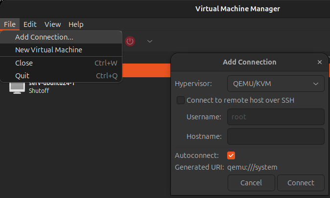

Можно добавить и **удалённые** хосты: для этого указывается SSH-подключение к серверу с libvirt.

---

## 2. Создание виртуальной машины

В главном окне нажмите **Создать новую виртуальную машину** (кнопка с иконкой компьютера со звёздочкой, или **File -> New Virtual Machine**).

### Шаг 1. Способ установки

Выберите источник установки ОС:

- **Local install media | Локальный носитель (ISO-образ или оптический диск)** - установка с локального образа;
- **Network install | Сетевая установка (URL | HTTP, HTTPS, FTP)** - автоматическая установка по URL-адресу дистрибутива. (Пример Debian(trixie): `https://deb.debian.org/debian/dists/trixie/main/installer-amd64/` );
- **Import existing disk image | Импорт существующего образа диска** - создание ВМ из готового образа;
- **Manual install | Ручная установка (установка по протоколу PXE)** - загрузка по сети;

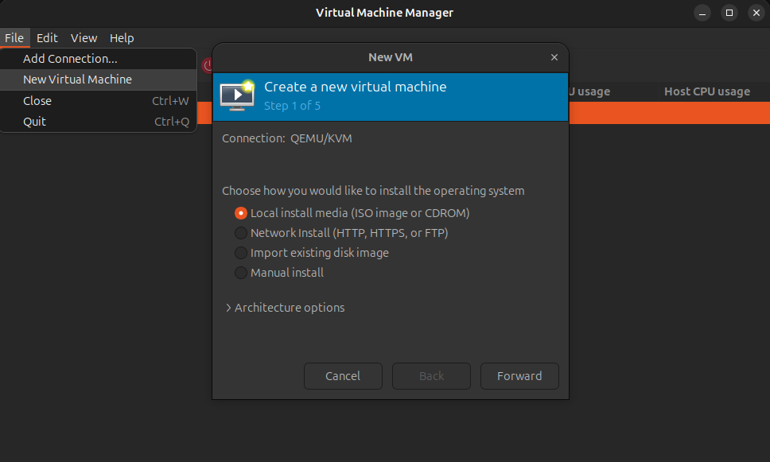

### Шаг 2. Указание ISO-образа

Укажите путь к ISO-образу. Если образ не виден, нажмите **Browse...** и укажите путь вручную (например, `/home/user/Downloads/ubuntu.iso`).

Система автоматически определит тип ОС по образу; при необходимости его можно изменить вручную.

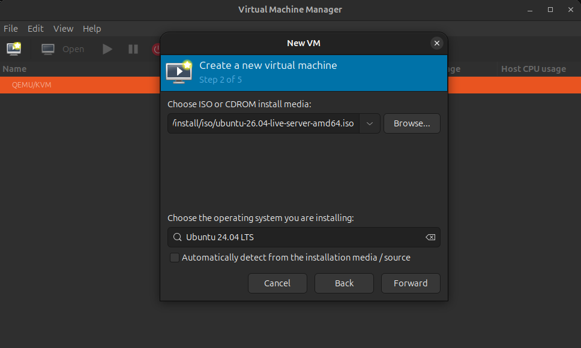

### Шаг 3. Параметры RAM и CPU

Определите объём оперативной памяти и количество процессоров (vCPU) для ВМ.

**Рекомендации:**

- минимум для современных ОС - **2 - 4 ГБ RAM**;
- ядра выделяйте исходя из нагрузки: для лёгких задач хватит **2 vCPU**;
- не выделяйте все ядра и всю память хоста - оставьте ресурсы для самой системы.

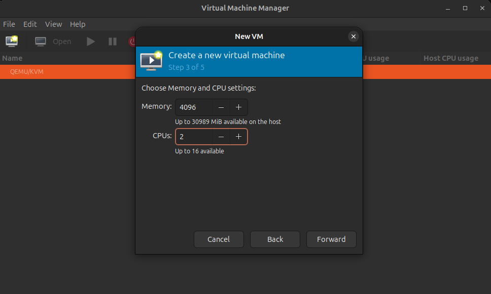

### Шаг 4. Создание диска

Укажите объём виртуального диска. Два варианта:

- **Create a disk image... | Создать образ диска** - virt-manager создаст диск автоматически (по умолчанию в `/var/lib/libvirt/images`), формат `qcow2`;
- **Select or create custom storage | Выбрать существующий диск** - указать готовый образ вручную, или создать со своими параметрами.

> Если хотите изменить место хранения, включите опцию **Выбрать управление хранилищем** и укажите нужный том/пул.

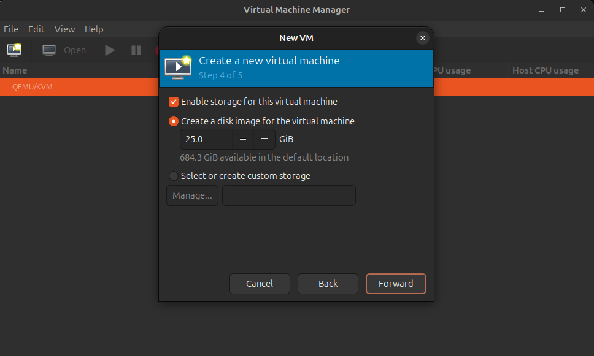

### Шаг 5. Финальная настройка

Укажите:

- **Name | Название ВМ** - произвольное имя (например, `serv-ubuntu24-1`);
- **Network selection | Сеть** - по умолчанию **NAT** (`default`); можно выбрать Bridge (мост) и другие.

При необходимости перед стартом отметьте **Настроить параметры перед установкой** - откроется окно конфигурации оборудования.

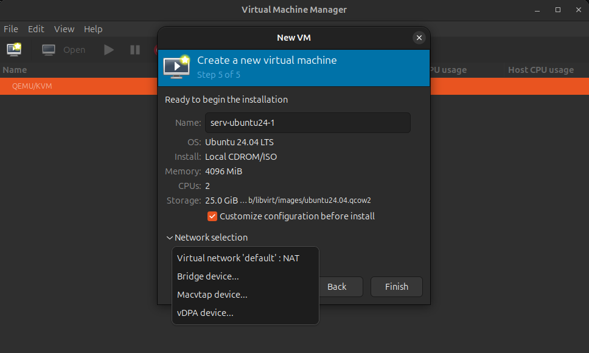

### Шаг 6. Настройка оборудования (опционально)

Здесь можно изменить параметры ВМ до начала установки:

- добавить/удалить диски, сетевые адаптеры, USB-устройства;
- изменить тип сетевой карты (рекомендуется **virtio**);
- включить видеоадаптер и звук.

После внесения изменений нажмите **Применить** и затем **Начать установку (Begin Installation)**.

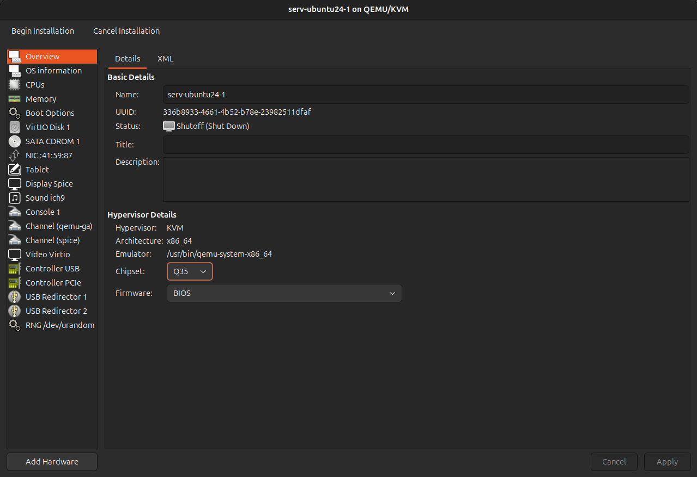

### Шаг 7. Установка ОС

Начнётся загрузка и установка ОС с выбранного ISO-образа. Дальнейшие действия - это стандартная установка дистрибутива внутри окна ВМ.

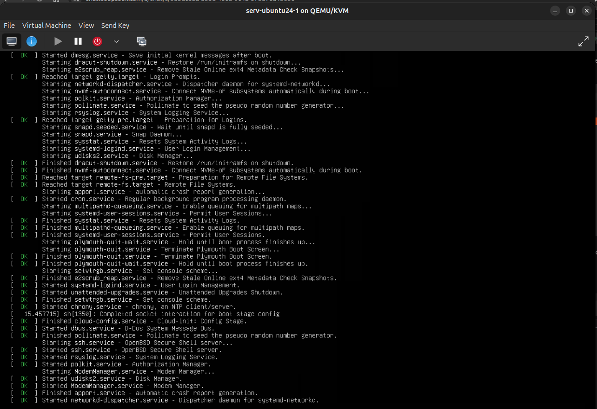

---

## 3. Установка гостевых инструментов (после установки ОС) для удобства при необходимости

Для комфортной работы с ВМ рекомендуется установить внутри гостевой ОС дополнительные пакеты.

### 3.1 Драйверы virtio

Повышают производительность дисков и сети. В большинстве современных дистрибутивов (Ubuntu 22.04+, Debian 11+, CentOS 9+) драйверы `virtio` уже встроены в ядро.

Проверить, используется ли virtio (вывод напоминает):
```bash
ls -l /sys/block/vda
```
Если устройство называется `vda` - virtio работает.

### 3.2 qemu-guest-agent

Обеспечивает корректное выключение ВМ из virt-manager и сбор статистики.

Ubuntu/Debian:
```bash
sudo apt install qemu-guest-agent
sudo systemctl enable --now qemu-guest-agent
```

### 3.3 spice-vdagent

Даёт доступ к буферу обмена, изменению разрешения экрана и перетаскиванию файлов между хостом и ВМ.

Ubuntu/Debian:
```bash
sudo apt install spice-vdagent
sudo systemctl enable --now spice-vdagent
```

После установки перезагрузите гостевую ОС.

---

## 4. Управление виртуальными машинами

### 4.1 Запуск, остановка, перезагрузка

В главном окне кликните правой кнопкой по ВМ или используйте панель инструментов:

- **Run | Запустить / Pause | Приостановить / Resume | Продолжить**;
- **Shut down | Выключить** (корректное завершение через ACPI - работает при установленном `qemu-guest-agent`);
- **Reboot | Перезагрузить**;
- **Force Reset | Принудительная перезагрузка**;
- **Force Off | Принудительно выключить** (аналог отключения питания) - использовать только если ВМ зависла.


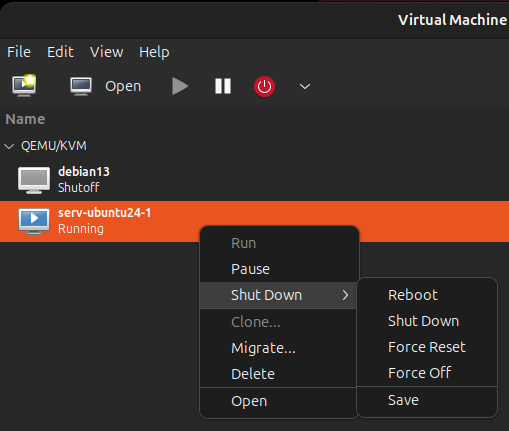


### 4.2 Снапшоты (Snapshots)

Создание снимка состояния диска позволяет быстро вернуться к предыдущему состоянию ВМ.

1. **Просмотр -> Детали** выбранной ВМ;
2. Вкладка **Manage VM snapshots | Снапшоты**;
3. Кнопка **+** внизу - создать снимок.

Снапшоты полезно делать перед рискованными операциями или значительными измененями, если захотите вернуться назад в прошлое (обновление ядра, изменение конфигурации).

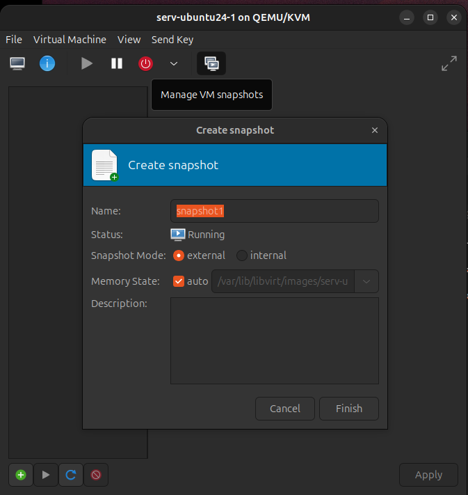


### 4.3 Клонирование ВМ

Создание копии ВМ вместе с диском, только на остановленной ВМ:

- **ПКМ -> Clone | Клонировать**
- Укажите новое имя и место хранения.

Клонирование удобно для быстрого создания одинаковых ВМ (например, рабочих станций).

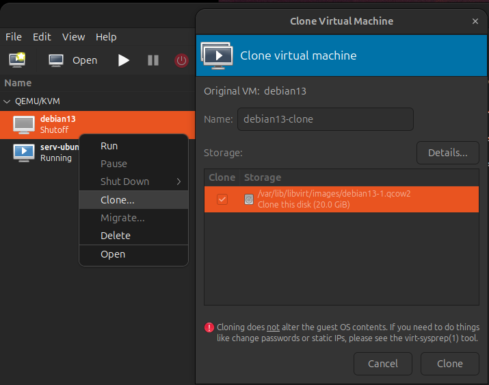

### 4.4 Автозапуск ВМ

Чтобы ВМ запускалась автоматически при старте хоста:

- **В настройках оборудования ВМ -> Boot Options -> Start virtual machine on host boot up** (поставить галочку).

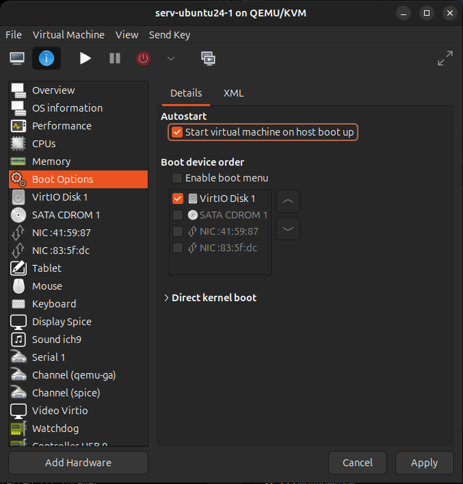

### 4.5 Удаление ВМ

- **ПКМ -> Delete | Удалить**
- Поставьте галочку **Delete associated storage files | Удалить связанные файлы хранилища** - если нужно удалить и виртуальный диск.

> Осторожно: удаление файлов хранилища безвозвратно удаляет диск ВМ.

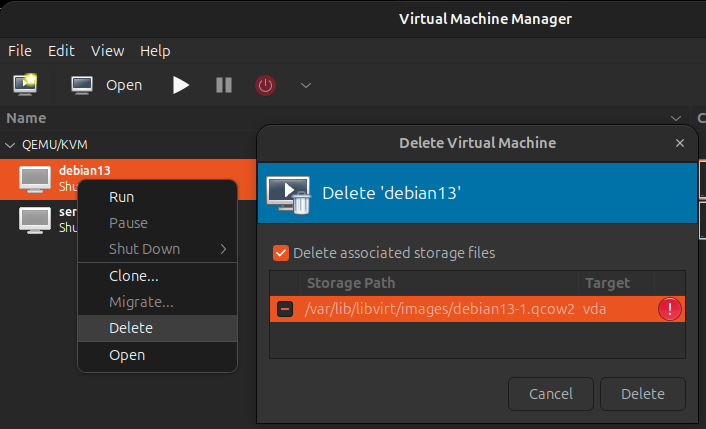

---

## 5. Настройка оборудования ВМ

Окно деталей ВМ открывается через **ПКМ -> Open -> Show virtual hardware details**.

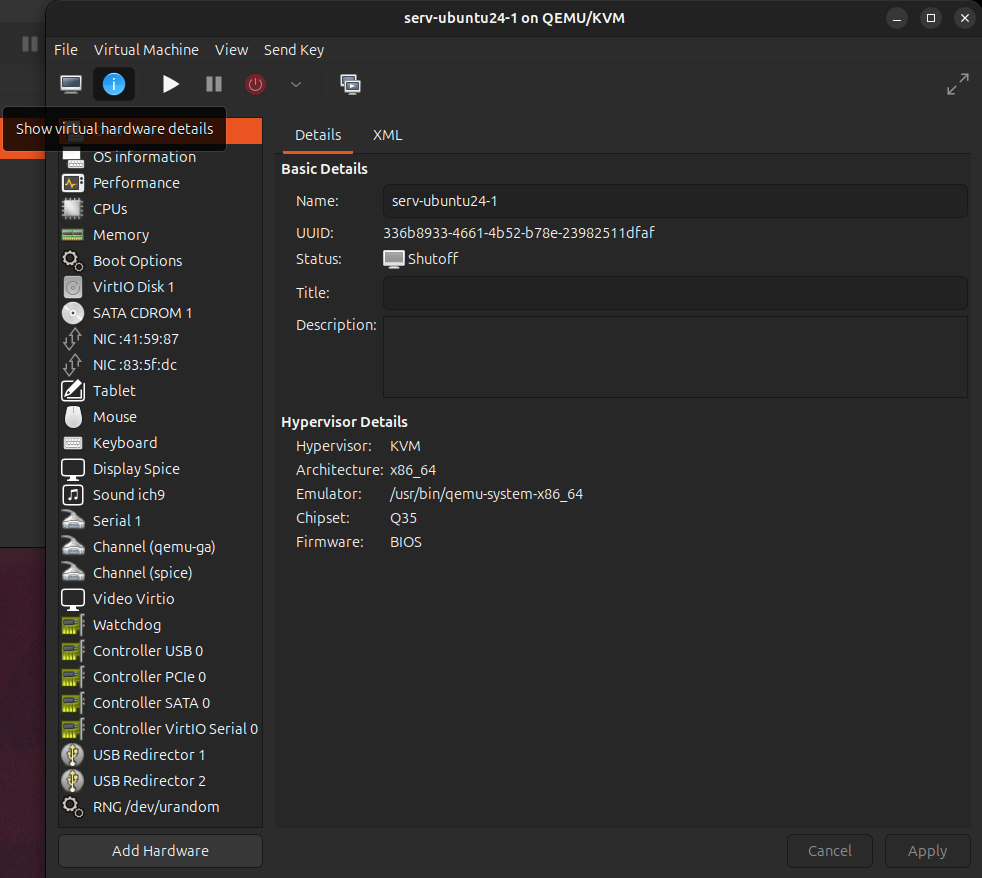

### 5.1 Изменение RAM и CPU

- **CPUs** 
- **Memory**;
- Измените объём памяти и количество процессоров.

> **Важно:** увеличение RAM/CPU в большинстве случаев требует перезагрузки гостевой ОС. Уменьшение онлайн возможно только при установленном `qemu-guest-agent`.

### 5.2 Добавление диска

- Кнопка внизу **Add Hardware**;
- Выберите **Storage** -> укажите объём или существующий образ.

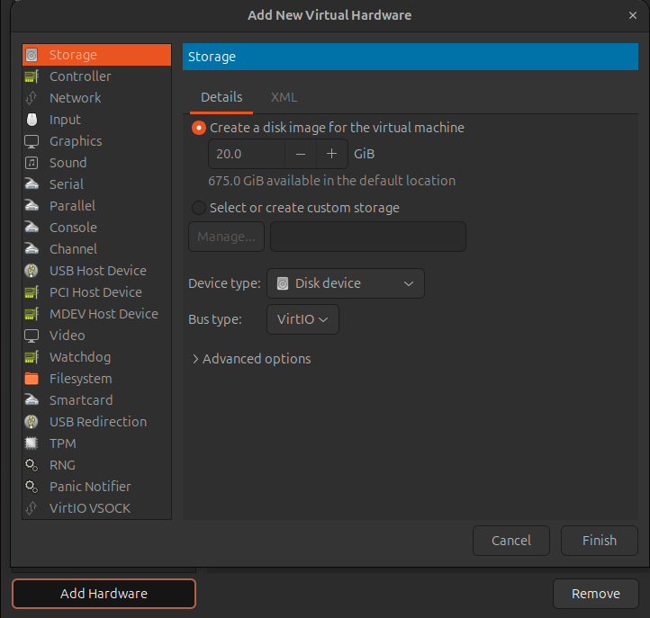


### 5.3 Сетевое подключение

- В списке устройств выберите сетевую карту;
- В поле **Network source | Сетевой источник** можно выбрать:
  - **NAT** (по умолчанию) - доступ в интернет, но в сети ВМ не видна;
  - **Bridge | Мост** - ВМ получает собственный адрес в локальной сети (требуется настроенный bridge-интерфейс на хосте);
  - **Macvtap** - похоже на Мост, но хост не может общаться по сети со своей ВМ;
  - **vDPA** - это мост для подключения ВМ напрямую к "железу", минуя программную обработку данных в ядре хоста.


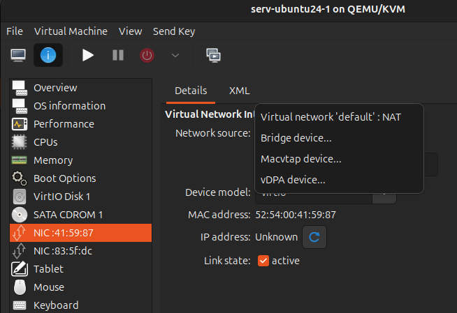


### 5.4 Проброс USB-устройств

Можно подключить физическое USB-устройство (флешку, принтер) прямо в ВМ:

- В списке устройств выберите **Контроллер USB**;
- Или **Add Hardware | Добавить оборудование -> USB Host Device | USB-контроллер** -> выбрать нужное из списка подключённых у хоста.

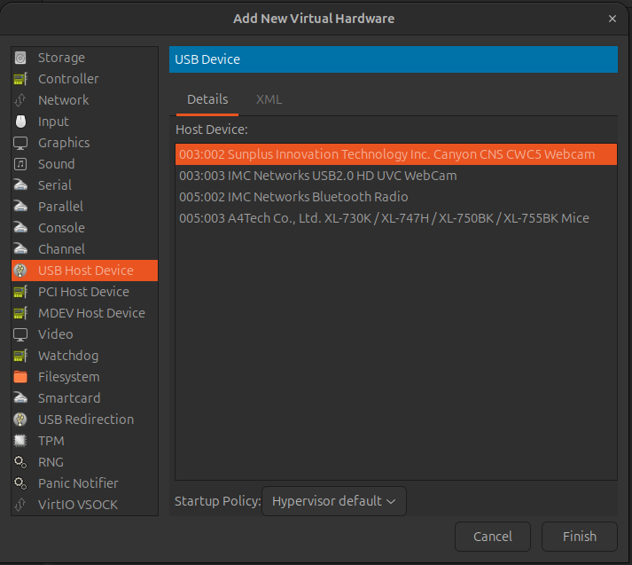

---

## 6. Просмотр статистики

Для каждой ВМ в окне деталей доступны графики:

- использование CPU;
- использование памяти;
- дисковые операции (I/O);
- сетевой трафик.

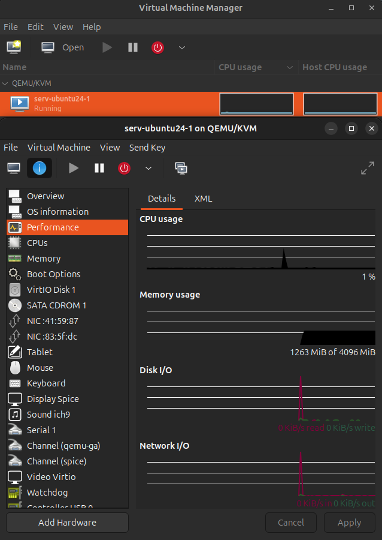

Для работы метрик рекомендуется установленный `qemu-guest-agent`.

---

## 7. Сравнение virt-manager и virsh

| Критерий | virt-manager | virsh |
|----------|--------------|-------|
| Интерфейс | Графический | Текстовый |
| Удобство для новичка | Высокое | Низкое |
| Автоматизация | Ограничена | Полная (скрипты) |
| Удалённое управление | Через добавочные подключения | По SSH напрямую |
| Занимаемые ресурсы | Выше | Минимальные |

**Рекомендация:**  для разовых операций и интерактивной работы удобнее `virt-manager`; для автоматизации и скриптов - `virsh`.

---

## 8. Типичные проблемы и их решения

| Проблема | Причина | Решение |
|----------|---------|---------|
| ВМ не запускается, ошибка KVM | Нет аппаратной виртуализации | Включить VT-x/AMD-V в BIOS, проверить `lsmod \| grep kvm` |
| Нет сети в ВМ | Сеть NAT не запущена | Проверить сеть в «Сведения о подключении», запустить `default` |
| ВМ не выключается «корректно» | Не установлен `qemu-guest-agent` | Установить агент в гостевой ОС |
| Нет буфера обмена между хост/ВМ | Не установлен `spice-vdagent` | Установить пакет в гостевой ОС |
| Медленная работа диска/сети | Задействована эмуляция вместо virtio | Использовать virtio-драйверы/устройства |
| Ошибка прав доступа | Пользователь не в группах `libvirt`/`kvm` | `sudo adduser $USER libvirt && sudo adduser $USER kvm`, перелогиниться |
| ВМ не видит USB-устройство | Проброс не настроен | Добавить USB-устройство в настройках ВМ |

---

## 9. Итог

- **virt-manager** - графический инструмент для полного управления виртуальными машинами KVM/QEMU.
- Основной сценарий: **создание ВМ -> установка ОС -> настройка гостевых инструментов -> управление/настройка**.
